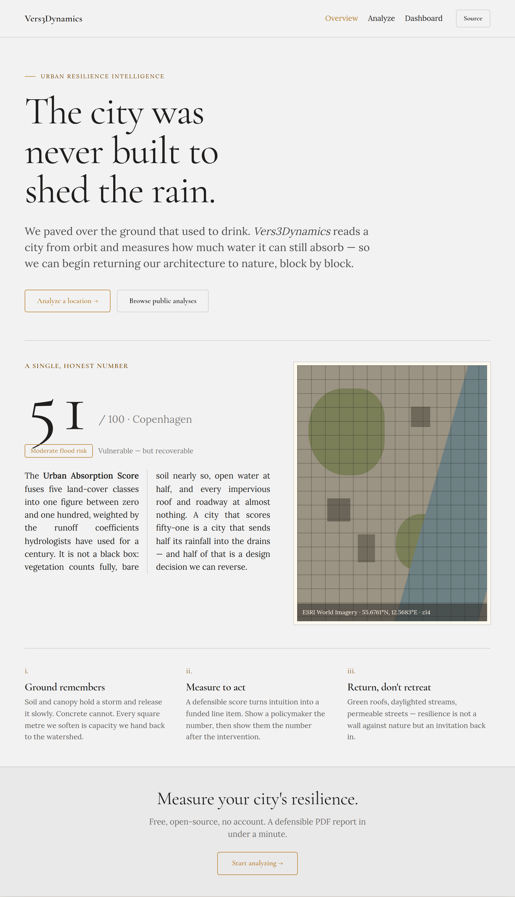
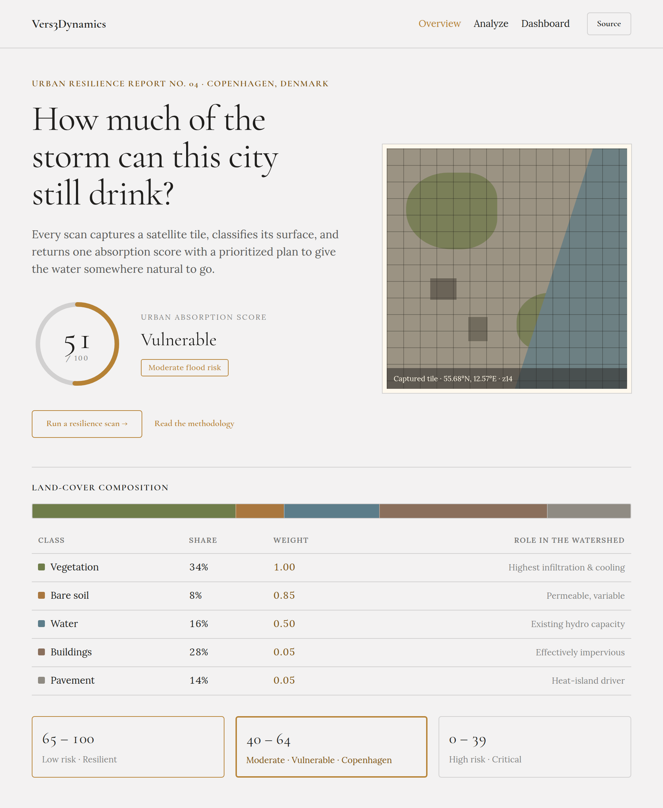
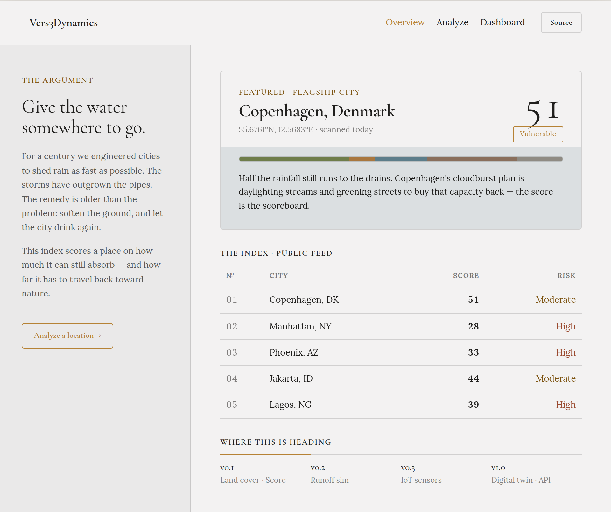

# Vers3Dynamics — Mannahatta (Urban Resilience Platform)

**Point it at any city block. Get a quantitative climate-resilience report back in seconds.**

Mannahatta is an open-source, AI-powered analytics platform that turns a
satellite tile into land-cover breakdown, an **Urban Absorption Score**, a
flood-risk band, and prioritized climate-adaptation recommendations — then
lets you stress-test green-infrastructure interventions and export the
results as a PDF, GeoJSON, or CSV. No survey crew, no proprietary dataset,
no lock-in.

Built as a modular foundation for climate-adaptation tooling — future modules
plug in hydrological simulation, IoT sensor fusion, and city-scale digital
twins.




## Contents

- [What the platform does today](#what-the-platform-does-today)
- [Scenario Studio & investment analytics](#scenario-studio--investment-analytics)
- [GIS interoperability](#gis-interoperability)
- [Architecture](#architecture)
- [Tech stack](#tech-stack)
- [Design language](#design-language)
- [The Urban Absorption Score](#the-urban-absorption-score)
- [Getting started](#getting-started)
- [Project structure](#project-structure)
- [Data model](#data-model)
- [Roadmap](#roadmap)
- [Contributing](#contributing)

## What the platform does today

| Capability | Where it runs |
|---|---|
| Interactive satellite map (MapLibre GL + free ESRI imagery, automatic Sentinel-2 fallback) | Frontend |
| Shareable deep links — every map view is a restorable URL | Frontend |
| Capture the visible map tile as an image | Frontend |
| Classify the tile into 5 land-cover classes via a vision LLM | (Gemini 2.5 Flash) |
| Compute an Urban Absorption Score (0–100) and flood-risk band | Edge function |
| Generate 4 adaptation strategies (green / blue / gray infrastructure) | Edge function |
| **Scenario Studio** — what-if modeling of depaving, bioswales, permeable pavement, and green roofs with live score, retention, cost, and payback | Frontend |
| Persist and browse a public feed with stats, search, and sorting | Postgres |
| Portfolio analytics — score distribution histogram and side-by-side site comparison | Frontend |
| Export any analysis as a PDF report (including the configured scenario) | Frontend |
| Export analyses as **GeoJSON** (footprint polygons) and **CSV** for QGIS / ArcGIS / spreadsheets | Frontend |

## Scenario Studio & investment analytics

Every analyzed tile can be stress-tested against four green-infrastructure
interventions, each converting a fraction of one land-cover class into a
surface with a different absorption weight:

| Intervention | Converts | Effective weight | Planning cost |
|---|---|:--:|:--:|
| Street trees & pocket parks | pavement | 1.00 | $45/m² |
| Bioswales & rain gardens | pavement | 0.90 | $65/m² |
| Permeable pavement | pavement | 0.75 | $150/m² |
| Green roofs | buildings | 0.60 | $180/m² |

Because the score is a weighted sum of cover shares, an intervention's effect
is exact and instant: `Δscore = share × fraction × (targetWeight − sourceWeight) × 100`.
The studio then sizes the site from its stored bounding box (spherical-earth
area) and derives:

- **Added retention** (m³/yr) from the score delta × site area × annual rainfall
- **Capital cost** from converted area × unit cost
- **Annual benefit** from a transparent $/m³-retained default
- **Simple payback** in years

All assumptions (rainfall, unit costs, benefit rate) are visible in the UI and
in `src/lib/scenario.ts` — calibrate them to your market before underwriting.
Configured scenarios flow into the exported PDF as a
"Scenario & Investment Analysis" section.

## GIS interoperability

No lock-in: analyses export as open formats from both the Analyze view
(single site) and the Dashboard (whole feed).

- **GeoJSON** (RFC 7946) — footprint `Polygon`s built from each scan's stored
  bbox (falling back to center `Point`s), with score, risk band, land-cover
  percentages, area in km², and a restorable deep link as properties. Drops
  straight into QGIS, ArcGIS, Felt, or PostGIS.
- **CSV** — the same attributes as a flat table for spreadsheets and BI tools.

## Architecture

```
┌────────────────────────────────────────────────────────────────────────┐
│                              Frontend (React)                           │
│   MapLibre GL  ▸  captureImage()  ▸  supabase.functions.invoke(...)     │
└─────────────────────────┬──────────────────────────────────────────────┘
                          │  POST { image_data_url, lat, lng, zoom, bbox }
                          ▼
┌────────────────────────────────────────────────────────────────────────┐
│               Edge function: analyze-terrain (Deno / TS)                │
│   1. Gemini 2.5 Flash  → land-cover JSON (5 classes)                    │
│   2. Weighted score    → Urban Absorption Score + flood risk            │
│   3. Gemini 2.5 Flash  → 4 adaptation recommendations                   │
│   4. INSERT INTO analyses                                               │
└─────────────────────────┬──────────────────────────────────────────────┘
                          ▼
                    Postgres
```

An **alternative Python backend** lives in [`backend/`](./backend) with a real
FastAPI service that runs a CV segmentation model locally instead of calling
an LLM. Deploy it separately (Render / Railway / Fly / Cloud Run) if you want
full model control.

## Tech stack

**Frontend**
- React 18 + TypeScript + Vite
- Tailwind CSS with a semantic HSL design system (`src/index.css`)
- MapLibre GL JS with free ESRI World Imagery tiles (no API key), with
  automatic failover to EOX Sentinel-2 cloudless imagery and an explicit
  reconnect UI if no provider is reachable
- shadcn/ui primitives + Radix UI
- TanStack Query, React Router, Sonner

**Backend (Lovable Cloud)**
- Supabase Postgres for persistence
- Supabase Edge Functions (Deno) for the analysis pipeline
- Lovable AI Gateway (Google Gemini 2.5 Flash)

**Reference Python backend (`backend/`)**
- FastAPI + Pydantic
- Pillow + NumPy heuristic segmenter (swap for DeepLabV3 / U-Net / SAM)
- Dockerfile for one-command deploy

## Design language

Three landing-page directions, all built on the same design tokens:

**1a · The Manifesto** — the hero shown above: a single gold-stroke argument
for why the platform exists.

**1b · The Field Report** — data-forward: a stroke gauge, a matted satellite
plate, and land-cover as a hairline ledger over the runoff weights.



**1c · The Index** — a catalogue of cities with a running argument in the
margin, a rising-waterline featured card, and the roadmap as a timeline.



| Token | Value | Role |
|---|---|---|
| `--color-bg` | `#f3f2f2` | Soft near-white ground |
| `--color-text` | `#201f1d` | Warm near-black text |
| `--color-accent` | `#b68235` | Single gold accent (mono scheme, used as stroke) |
| `--color-divider` | `#201f1d` @ 16% | Hairline rules |
| `--font-heading` | Cormorant Garamond | Headings, capped at semibold |
| `--font-body` | Lora | Justified body copy |
| `--radius-md` | `4px` | Baked-in corner radius |

Inspired by my favorite version of [NYC](https://www.welikia.org/); Kintecoying, Manahatta

## The Urban Absorption Score

A single 0–100 number derived from land-cover percentages, weighted by
simplified runoff coefficients from urban hydrology:

| Class       | Weight | Rationale                                    |
|-------------|:------:|----------------------------------------------|
| Vegetation  | 1.00   | Highest infiltration and evapotranspiration  |
| Bare soil   | 0.85   | Permeable, variable                          |
| Water       | 0.50   | Existing hydro capacity, not new absorption  |
| Buildings   | 0.05   | Effectively impervious                       |
| Pavement    | 0.05   | Effectively impervious                       |

**Flood-risk bands**

- **65+ · Low** — resilient
- **40–64 · Moderate** — vulnerable
- **< 40 · High** — critical

Weights are intentionally simple and transparent. Calibrate them against local
runoff data in `src/lib/absorption.ts` (frontend) and
`backend/app/services/scoring.py` (Python backend).

## Getting started

```bash
git clone https://github.com/topherchris420/cognisync-terrain-weaver.git
cd cognisync-terrain-weaver
npm install
npm run dev
```

The dev server runs at `http://localhost:8080`.

### Scripts

| Command | What it does |
|---|---|
| `npm run dev` | Vite dev server on port 8080 |
| `npm run build` | Production build (route-level code splitting) |
| `npm run lint` | ESLint |
| `npm run typecheck` | `tsc --noEmit` |
| `npm test` | Vitest unit tests (scoring logic) |

All four checks run in CI on every push and pull request
(`.github/workflows/ci.yml`).

### Running the reference Python backend

```bash
cd backend
python -m venv .venv && source .venv/bin/activate
pip install -r requirements.txt
uvicorn app.main:app --reload --port 8000
```

See [`backend/README.md`](./backend/README.md) for deployment and for how to
swap the naive HSV-based segmenter for DeepLabV3, U-Net, or SAM.

## Project structure

```
src/
├── pages/
│   ├── Index.tsx          Landing page
│   ├── Analyze.tsx        Map + analysis workflow
│   └── Dashboard.tsx      Public feed of analyses
├── components/
│   ├── AppNav.tsx
│   ├── MapView.tsx        MapLibre wrapper + image capture
│   ├── AbsorptionScoreGauge.tsx
│   ├── LandCoverBreakdown.tsx
│   ├── RecommendationsList.tsx
│   ├── ScenarioStudio.tsx What-if intervention modeling + ROI panel
│   └── SiteComparison.tsx Side-by-side comparison of two analyses
├── lib/
│   ├── types.ts           LandCover, Recommendation, Analysis
│   ├── absorption.ts      Score + risk classification
│   ├── absorption.test.ts Unit tests for scoring + risk bands
│   ├── scenario.ts        Interventions, projections, retention, cost, payback
│   ├── scenario.test.ts   Unit tests for scenario math + finance
│   ├── geo.ts             BBox parsing, spherical area, GeoJSON/CSV export
│   ├── geo.test.ts        Unit tests for the GIS toolkit
│   └── pdf-export.ts      PDF report generation (lazy-loaded)
└── integrations/
    └── supabase/          Auto-generated Cloud client

supabase/
├── functions/analyze-terrain/index.ts
├── migrations/            Schema history
└── config.toml

backend/                   Reference FastAPI service (not run by Lovable)
```

## Data model

`public.analyses` — one row per resilience scan. Publicly readable and
insertable (this is a public demo dataset — swap in auth-scoped RLS if you
fork it for a private deployment).

| Column | Type | Notes |
|---|---|---|
| id | uuid PK | |
| name | text | user-supplied |
| location_label | text | optional |
| center_lat, center_lng, zoom | float | map viewport |
| bbox | jsonb | `[[west,south],[east,north]]` |
| land_cover | jsonb | `{ pavement, buildings, vegetation, water, soil }` |
| absorption_score | numeric(5,2) | 0–100 |
| flood_risk | text | `low` / `moderate` / `high` |
| recommendations | jsonb | array of `{ title, description, priority, category }` |
| ai_notes | text | short LLM description of the tile |
| status | text | `complete`, `pending`, etc. |
| created_at | timestamptz | |

## Roadmap

- **v0.1** ✅ — Land cover classification, absorption scoring, adaptation LLM
- **v0.2** ✅ — Scenario Studio (what-if interventions + investment analytics), GeoJSON/CSV export, portfolio comparison
- **v0.3** — Hydrological runoff simulation (SWMM integration), IoT sensor fusion (rain gauges, soil moisture over MQTT)
- **v1.0** — Digital twin export + public REST/GraphQL API

## Contributing

This is an open, community-driven project. PRs welcome — especially for
better segmentation models, calibrated runoff weights per climate zone, and
new adaptation-strategy templates.

## License

MIT.

---

Built by [Vers3Dynamics](https://vers3dynamics.com)
