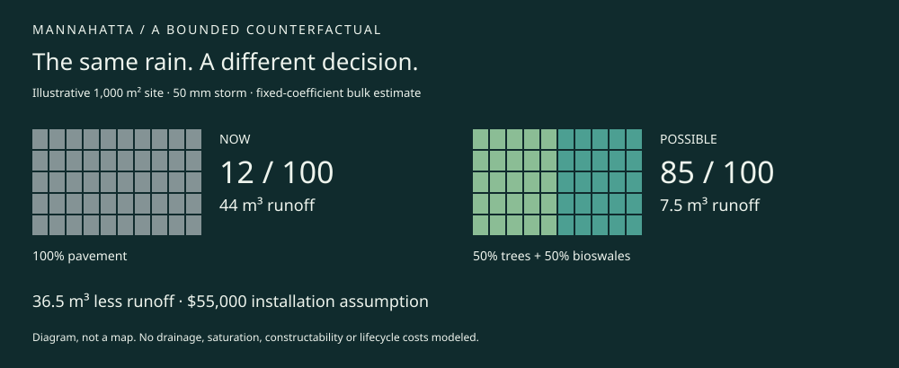

# Mannahatta

**The land remembers. The city is not finished.**

A counterfactual urban resilience instrument: examine what a place was, model what happens when rain meets its present surfaces, and ask what would have to change.

**What was. What is. What could be.** The map is the workspace; the score is the beginning of the question.



This is a reproducible calculation, not a measured site outcome or a screenshot. A hypothetical 1,000 m² paved site under 50 mm rainfall generates 44 m³ of bulk runoff. Converting half to trees and half to bioswales produces 7.5 m³ under the same fixed-coefficient model, at an assumed installation cost of $55,000. The map-based workflow additionally routes water over terrain; these two calculations are deliberately separate.

## Start with a place

1. Open the map and choose **Explore an example**. The fixture works without an AI classification request; its status stays visible in exports.
2. In **Overview**, inspect the composition, historical reconstruction where available, and vegetation–pavement sensitivity. Live scans also expose the captured imagery.
3. In **Storm**, choose rainfall and resolution, then route a one-hour design event. Its forcing is sealed for the comparison.
4. In **Mitigation**, ask Catalyst what a target and budget permit. Then draw supported interventions on the actual study extent.
5. Rerun the sealed storm and compare **NOW / POSSIBLE** with the synchronized map view.
6. Export the study or its **experiment evidence JSON**, including inputs, drawings, coefficients, forcing and available routed results.

Live imagery, historical rasters and elevation require their external services. If elevation cannot load, a deterministic slope is explicitly **illustrative**. Example land cover never becomes a measurement merely because the terrain loaded successfully.

## Three questions, different evidence

| Frame | What it contains | What it does not establish |
|---|---|---|
| **1609 — what was** | Welikia ecological reconstruction reduced to block bounding boxes where coverage exists; a separately labeled island-wide reference score of 79.1 | Surveyed historical boundaries, a complete settlement history, or the history of an arbitrary block outside coverage |
| **Present — what is** | Captured imagery, inferred five-class land cover and deterministically derived score | A surveyed surface map, measured infiltration or validated flood probability |
| **Possible — what could be** | Interventions evaluated with the same coefficients and, for routed pairs, the same storm and terrain | A forecast, construction approval or prediction of political adoption |

Mannahatta's historical frame concerns land inhabited and shaped by the Lenape. An ecology reconstruction is not an account of empty or untouched land. The written five-class benchmark is this application's estimate informed by the Mannahatta/Welikia descriptions, **not a five-class dataset published by WCS**. The reconstructed block index is a different source and must retain its own transformation notes.

## What would have to change?

Catalyst is available in Mitigation as an inspectable planning envelope. Enter a target score and installation budget to see:

- current and achievable scores;
- the unconstrained surface ceiling and budget-constrained ceiling;
- the remaining gap and binding constraint;
- a least-cost mix when the target is reachable, or the highest attainable score otherwise.

The solver uses the upper cost/retention envelope for each source surface. It can replace a cheaper intervention with a more effective one: trees and bioswales compete for the same pavement. A simple greedy list of whole intervention types cannot solve that problem correctly. A $0 budget means no spending.

This is a **continuous aggregate allocation**, not parcel engineering. It assumes all classified source area is available. The spatial editor applies a separate eligibility contract; green roofs and permeable pavement remain unavailable in the current main workstation because their mapped eligibility layers are not loaded. Trees and bioswales carry explicit feasibility caveats. An aggregate proposal does not silently place polygons or become a routed result.

Installation assumptions are USD/m²: trees **45**, bioswales **65**, permeable pavement **150**, green roofs **180**. Source year, local geography and inflation basis are not documented. Maintenance, replacement, permitting and land acquisition are excluded. Annual retention and monetized benefit are scenario assumptions, not audited returns. Cost rankings are conditional on these rates.

## What if the classification is wrong?

The land-cover classifier is a substantial uncertainty source. The [18-site calibration record](docs/absorption-calibration.md) documents suspiciously rounded outputs and frame-size effects.

Overview now offers a bounded experiment: transfer a chosen number of percentage points between vegetation and pavement, preserving the other classes and total area. It reports the resulting scores and 50 mm bulk runoff. Transfers stop when a source class runs out. It leaves the stored analysis untouched.

This is **sensitivity analysis, not a statistical confidence interval**. It does not quantify every source of error. The shared input contract rejects incomplete, negative, non-finite or materially unbalanced compositions before accepting classifier/MCP percentages. Scores are computed by code, not accepted from a model narrative.

## Two water models, explicit limits

### Bulk land budget

The score is a weighted screening index normalized over land:

`score = 100 × Σ(land-cover share × retention weight) / total land share`

| Class | Retention weight |
|---|---:|
| Vegetation | 0.80 |
| Bare soil | 0.70 |
| Buildings | 0.10 |
| Pavement | 0.12 |
| Open water | Excluded from the land denominator |

Scenario costs and water volumes use physical land area, excluding open water. The rainfall workbench compares 10, 25, 50, 100 and 200 mm, with a continuous 0–200 mm control and an accessible table. For every depth, retained volume + runoff = rain on land.

Fixed coefficients yield linear responses: this model **cannot identify saturation or a storm intensity at which an intervention stops working**. Its rainfall presets are exploratory depths, not sourced return periods.

### Terrain routing

The browser loads Terrarium elevation onto a finite grid, computes D8 steepest-downhill routing, and applies intervention modifiers only to affected cells. A synthetic slope is used and labeled if elevation is unavailable. NOW and POSSIBLE share rainfall, duration, resolution and elevation identity; edited futures invalidate the previous comparison. Surface identities include study bounds and classified cover.

The engine conserves rain across retained/infiltrated, stored and runoff terms. It constructs a volume-scaled triangular hydrograph. **The hydrograph shape is prescribed, not calibrated discharge.** Accumulation divided by cell area is an equivalent routing metric, not hydraulically solved standing-water depth. Display severity is relative within a run, so colored zones must not be read as official hazard categories.

No calibrated sewers, storm surge, antecedent moisture or surveyed soil profiles are present. The lumped land-only budget and spatial routing have different area assumptions, particularly at waterfronts; their totals are not interchangeable.

## AI proposes; deterministic code decides

AI classifies imagery and proposes explanatory recommendations. Code calculates scores, allocations, budgets, eligibility, routing and comparison identities.

MCP currently exposes scan read/write operations and deterministic land-cover scoring. Authenticated writes use the signed-in user's access rules. They validate complete percentage compositions and recompute scores. They do **not** yet provide a full storm-planning benchmark, a complete action audit trail, or an autonomous planning loop. User- or agent-supplied cover is not independent observational evidence.

The old `/tactical` operating-picture demonstration generated synthetic hazards around arbitrary coordinates. It is retired from public navigation; existing links now explain the limitation and return to the actual workstation. Its internal demo components remain in the repository for traceable future work.

## Evidence that travels

| Export | Included | Boundary |
|---|---|---|
| CSV / GeoJSON | Study identity, extent, cover, score, model label, example/provenance status and caveat | Geometry is the study boundary, not a flood extent |
| PDF | Analysis summary, explicit provenance labels on every page, optional aggregate scenario | Does not contain the routed storm pair |
| Experiment JSON | Classified cover, extent, intervention geometry, coefficients/cost assumptions, sealed storm, routed outputs when present, evidence hash | Does not embed imagery or DEM samples; not a complete replay archive |

The evidence hash identifies the exported content using the existing deterministic hash utility. It is not a cryptographic signature. The current share action reopens a **map view**, not an entire experiment. Import/replay and compact scenario-sharing remain future work.

## Architecture

| Domain | Implementation |
|---|---|
| Map and study orchestration | `src/pages/Analyze.tsx`, MapLibre, `MapEditor` |
| Aggregate physics and planning | `src/lib/absorption.ts`, `scenario.ts`, `paired-storm.ts`, `catalyst.ts` |
| Sensitivity | `src/lib/land-cover-sensitivity.ts` |
| Spatial constraints and identity | `src/lib/counterfactual/` |
| Local terrain routing | `src/lib/hydrology/` |
| Historical reconstruction | `src/lib/historical/`, `public/data/welikia-1609-blocks.json` |
| Evidence and reports | `experiment-export.ts`, `geo.ts`, `pdf-export.ts` |
| AI classification and persistence | Supabase `analyze-terrain`; shared `land-cover.ts` contract |
| Agent interfaces | `src/lib/mcp/`; generated Supabase MCP bundle |

The local D8 engine is the main workstation path. The separate `run-simulation` edge function and Python reference backend still exist; they are not prerequisites for local storm experiments. Large map/application bundles remain a performance limitation.

## Run locally

Use **Node 22** and **npm**, matching CI. `package-lock.json` is canonical.

```bash
git clone https://github.com/topherchris420/cognisync-terrain-weaver.git
cd cognisync-terrain-weaver
npm ci
npm run dev -- --host 127.0.0.1
```

Open `http://127.0.0.1:43147`. Configure `VITE_SUPABASE_URL`, `VITE_SUPABASE_PUBLISHABLE_KEY` and, for MCP, `VITE_SUPABASE_PROJECT_ID` for your Supabase project. Browser configuration must contain only public keys; classifier/service secrets belong in Supabase edge-function secrets. The example skips the classifier request but the app still initializes its Supabase client. Deploying source changes to edge functions is a separate step from the frontend build.

```bash
npm test
npm run typecheck
npm run lint
npm run build
```

Tests cover coefficient synchronization, water balance, geometry constraints, paired identities, async staleness, cost allocation, classification contracts, sensitivity, provenance and exports. Passing tests establishes implementation consistency, **not empirical flood validation**.

See [implementation evidence and remaining gaps](docs/counterfactual-instrument.md), [source ledger and validation protocol](docs/validation-protocol.md), [calibration](docs/absorption-calibration.md), and [prior delivery evidence](docs/elevation-delivery.md).

## Scientific boundary

The score has **not been validated against observed flooding**. Historical reconstruction is not direct measurement. Conceptual eligibility is not a site survey. Screening hydrology is not a flood forecast. These boundaries belong to the instrument, not its fine print.

*It is an argument about physics, not a forecast about politics.*

Built by [Vers3Dynamics](https://vers3dynamics.com). [MIT license](LICENSE).
